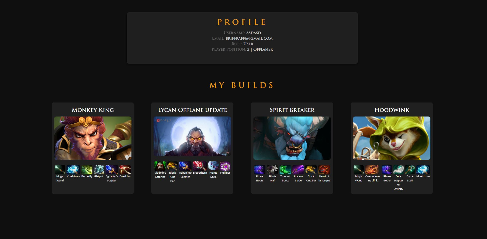

# DotaBuilds2
This is a school project in Angular. DotaBuilds2 is a place where you can create your own hero builds and find other user's hero builds.

- [DotaBuilds2](#dotabuilds2)
  - [Demo Screenshots](#demo-screenshots)
  - [Build with](#build-with)
  - [Installation](#installation)
  - [Pre-seed data:](#pre-seed-data)
  - [Links](#links)

## Demo Screenshots

Header


Footer


GUESTS:

Home


<!-- The Game
 -->

Dota Heroes


Hero Details


Dota Items


Item Details


Builds


Build Details


404 - Not Found


Register


Login


LOGGED USERS:

Create Build


User Profile


Edit Delete Build


## Build with 
[Angular](https://angular.dev/)

[Firebase](https://firebase.google.com/)

- [Authentication](https://firebase.google.com/products/auth)
- [Database](https://firebase.google.com/products/firestore)

D
[Sass](https://sass-lang.com/)

[CSS](https://bg.wikipedia.org/wiki/CSS)

[HTML](https://bg.wikipedia.org/wiki/HTML)

[ TypeScript](https://www.typescriptlang.org/)

## Installation

Step-by-step instructions on how to set up the project locally.

```bash

# Clone the repository
git clone git@github.com:briffraff/DotaBuilds2.git

# Navigate to the project directory
cd DotaBuilds2

# install needed dependencies
npm install

# run
ng serve

# open broject in browser
http://localhost:4200/

```

## Pre-seed data:
```bash

## Users :
--- Admin
"e-mail" : admin@abv.bg
"password": admin123

--- User
"e-mail": asd@abv.bg
"password": asdasd

"e-mail": stavri@abv.bg
"password": asdasd

## Dota Heroes :

## Dota Items

```
## Links
https://www.svgrepo.com/

https://www.dota2.com/home
